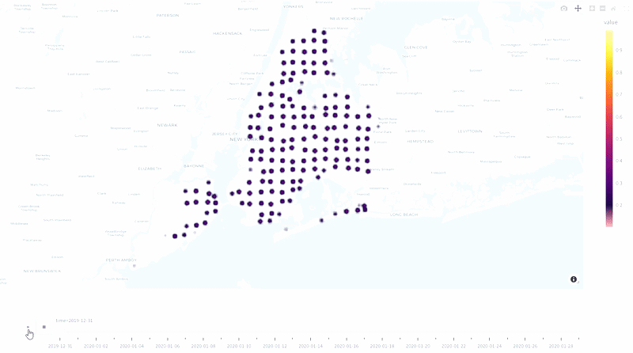

# NYC Spatiotemporal Crime Prediction using ConvLSTM

## Overview

This project explores spatiotemporal crime forecasting in New York City using deep learning and geospatial analysis.

A ConvLSTM neural network is trained on historical NYPD complaint records to learn spatial and temporal crime dynamics across NYC. The model predicts future crime hotspot probabilities and visualizes them through an interactive Streamlit dashboard.

The project includes:
- data preprocessing
- spatial grid construction
- temporal tensor generation
- ConvLSTM hotspot forecasting
- model evaluation
- interactive GIS visualization

## GIF Demonstration

This animation provides a preview of the Streamlit application, showing the interactive crime hotspot prediction interface the user will experience when running the project locally.



---

## Dataset

The original dataset used in this project is publicly available on Kaggle:

[NYPD Complaint Data Historic (2006–2019)](https://www.kaggle.com/datasets/brunacmendes/nypd-complaint-data-historic-20062019)

The dataset contains approximately:

```text
6,983,207 rows
```

The original dataset is preprocessed here:  

however, its preprocessed version can be retrieved and downloaded here:

https://www.kaggle.com/datasets/ydg886/nyc-crime-preprocessed-data

so that the streamlit application can be ran on its own without the need of running the notebook

Because of their size, both dataset are not included in this repository.

---

## GPU Recommendation

Training the ConvLSTM model on the full NYC dataset is computationally intensive.

A GPU is highly recommended for:
- tensor generation
- ConvLSTM training
- large-scale prediction inference

The model in this project was trained using GPU acceleration.

---

## Project Structure

```text
nyc-spatiotemporal-crime-prediction-convlstm/
│
├── README.md
├── requirements.txt
├── .gitignore
│
├── notebooks/
│   └── nyc_crime_prediction.ipynb
│
├── app/
│   └── app.py
│
├── models/
│   └── model.keras
│
├── assets/
   └── demo.gif

```

---

## Model Architecture

The forecasting pipeline uses:
- ConvLSTM2D layers
- Batch normalization
- spatial hotspot tensors
- sequential temporal windows

The model learns:
- spatial crime distributions
- temporal hotspot evolution
- future hotspot probabilities

---

## Technologies Used

- Python
- Pandas
- NumPy
- TensorFlow / Keras
- Plotly
- Streamlit
- Scikit-learn
- Matplotlib
- Seaborn

---

## Installation

Clone the repository:

```bash
git clone https://github.com/yourusername/nyc-spatiotemporal-crime-prediction-convlstm.git

cd nyc-spatiotemporal-crime-prediction-convlstm
```

Install dependencies:

```bash
pip install -r requirements.txt
```

---

## Running the Streamlit App

```bash
streamlit run app/app.py
```

---

## Streamlit Features

The dashboard includes:
- animated crime hotspot heatmaps
- future hotspot forecasting
- configurable prediction windows
- adjustable prediction thresholds
- interactive geospatial visualization

---

## Model Performance

Evaluation metrics include:
- Precision
- Recall
- F1-score
- confusion matrix analysis

Example results:

```text
Precision: 0.7580
Recall:    0.8123
F1-score:  0.7842
```

---

## Future Improvements

Potential extensions include:
- granular-specific forecasting wrt time (e.g. hourly)
- additional time-sensitive variables (e.g. weather, mobility data etc...)

---

## License

This project is intended for educational and research purposes.
